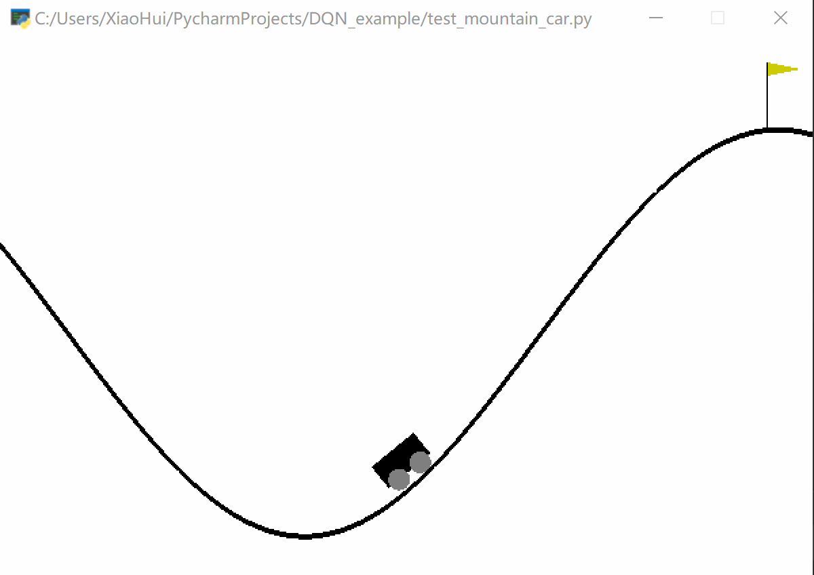
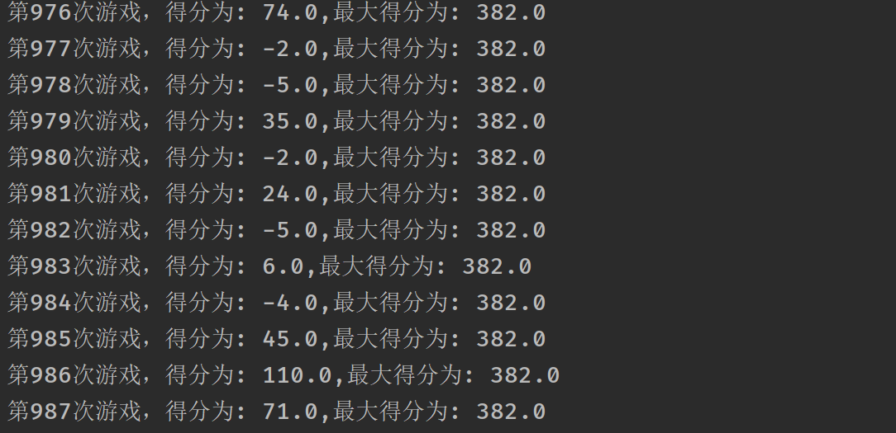

项目代码解释博客地址：https://www.cnblogs.com/xiaohuiduan/p/13021970.html

关于代码的解释可以看注释或者看博客。

## 项目使用说明

安装好需要的库文件，具体的在requirement.txt中。

1. bird.py：FlappyBird的训练代码。
2. mountain_car.py：MountainCar-v0的训练代码
3. car_model.h5：已经训练好的MountainCar-v0模型 
4. test_mountain_car.py：测试MountainCar-v0的代码

## 效果

至于为什么没有🐦的模型，这是因为截至写完博客，还没有完全的训练好。**mountain_car**的训练效果如下所示：

FlappyBird的训练部分数据：

